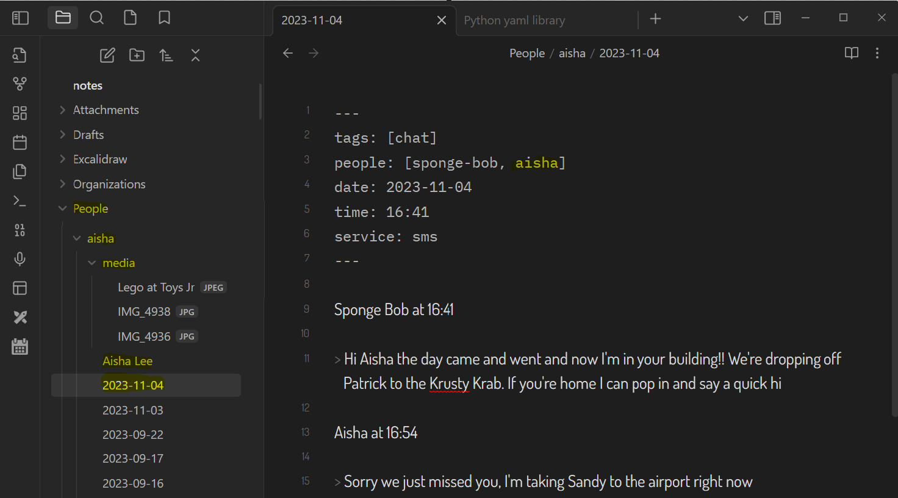
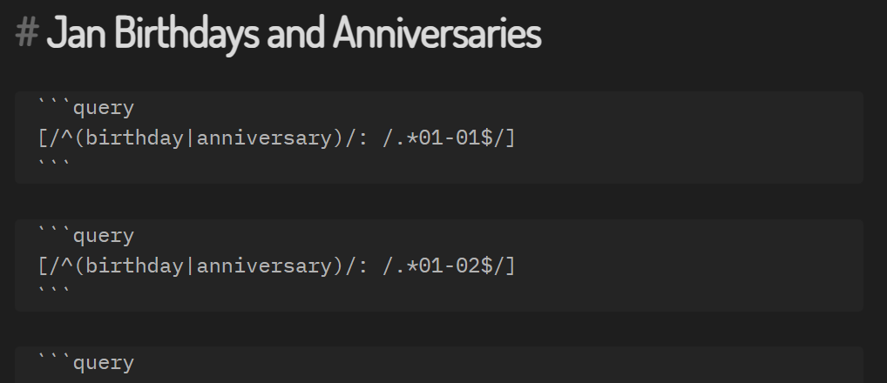
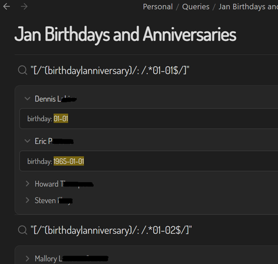

# hal_md

Personal relationship management of your ego social network using plain-text Markdown files. Think of it like a Personal CRM on steroids. You'll need steroids and patience to create the Markdown files but they'll be yours forever.

This is a collection of templates with instructions and over time it will evolve. The approach relies heavily on a Personal Knowledge Management (PKM) tool like [Obsidian](https://obsidian.md/) but could work with any text editor.

## Context

Getting here has been a decades-long journey which you can read about in [The Long and Winding Road](docs/journey.md).

## Start with the end in mind

This will take a long time to build out and require some attention to detail. 

Here's the visualization of my social network in Obsidian. This is using a filter of the Markdown files that have `tags: [person]` in their frontmatter – the meta-data at the top of my note files. The colors represent which category I have the person in such as the bright green for my "A-listers" where I have the tags `person` and `alist`. Red is for `flist`, i.e., the people that I don't want to keep in touch with for various reasons.

## Navigating your social network

You can use any text editor but preferably one that supports wikilinks, YAML frontmatter, and queries. 

1. [Obsidian](https://obsidian.md/) by fellow Canadians [Erica Xu](https://github.com/ericaxu) and [Shida Li](https://github.com/lishid)
2. [Silver Bullet](https://github.com/silverbulletmd) which is Open-Source by Polish [Zef Hemel](https://github.com/zefhemel)

I haven't checked if [GitJournal](https://github.com/GitJournal/GitJournal) by [Vishesh Handa](https://www.linkedin.com/in/visheshhanda/) supports YAML frontmatter but it does support wikilinks so you'll still be able to navigate your notes.

As shown in the above image, Obsidian has a graph view (aka Map of Content aka MoC) which is a really fun way to visualize and navigate your social network. The local graph view is much more useful at an individual person level. 

[Visual Studio](https://visualstudio.microsoft.com/) is also handy for bulk changes.

## How it works

Simply use Obsidian and start creating files for each `Person` and optionally `Organization` and `Place` using the [Templates](#templates)  provided. Include wikilinks in the body of the file in the form of `[[name]]` to "connect" the people, places, and organizations together as you go. 

1. Create a file for a person in your network
2. Use the [Person.md](templates/Person.md) template
3. Name the file `FirstName Lastname.md`
4. Fill in as little or as much of the metadata on the person
5. List the people they're connected to under `## People` using `[[FirstName LastName]]` 
6. List their positions under `## Positions` using `Title, [[Organization Name]]` 
7. Click on each person under `## People`
8. Have a sip of your favorite drink
9. Go to Step 2

### Bonus points

For each Organization under `## Organization` fill in as little or as much information on the organization.

For each person under `## People` add [tags](docs/tags.md) like `#friend` or `#strong` to track the strength of the ties between them.

## Folders, or no Folders, it's up to you

Organize your notes as you wish. I like to have folders.

- `Attachments` - for any files, images, photos
- `Organizations` - put all the company profiles in here
- `People` - put all the people in here. Subfolder with their `slug` and then dated files for each interaction
- `Personal` - my personal notes
- `Templates` - the files from [Templates](#templates) 

For most people, I create a folder for them and a sub-folder `media` for a photo of them and any images or files we shared with each other. 

My [Helper Tools](#helper-tools) put images and files I've shared into those `media` subfolders. For people that I haven't communicated with, I stuff those in `People\others` 

## Templates

These are a set of templates to track your social network. Each contain a set of metadata at the top of the files also known as YAML frontmatter. If you're not technical, don't worry as Obsidian makes it easy to edit that information.

File | For what | Notes
---|---|---
[Call.md](templates/Call.md) | A phone call | Do people still make these?
[Chat.md](templates/Chat.md) | Instant messaging chat | e.g. LinkedIn, Signal, SMS
[Organization.md](templates/Organization.md) | Schools and companies | Where a `Person` studie, volunteers, or works
[Person.md](templates/Person.md) | A person | The actual person!
[Place.md](templates/Place.md) | A physical place | Places people including you have been (e.g vacations, recommendations)
[Post.md](templates/Post.md) | Social media or blog post  | Material post by a `Person` 
[Product.md](templates/Product.md)| Product | A product worked on by a `Person` and/or `Organization`
[Video.md](templates/Video.md) |  Videos | e.g. YouTube video by `People`

## Frontmatter matters

A big part of this working well will be maintaining the frontmatter, you can sip things in over time like a new skill for a person or a new interest. You don't have to do it all at once. Just start. In this example, you can see if you click in the skills field, Obsidian shows a list of skills other people have which makes it easy to be consistent across all people with that skill.

## List of birthdays and anniversaries

With standard Obsidian (no additional plugins), create a file for each month of the year and include embedded queries to show the birthdays and anniveraries that month. The sample query files are [here](queries) and here's what they look like:

Which results in this (a bit ugly as you see the regex):

## Helper tools

I've written some Python tools to convert the exports from various messaging apps to Markdown. 

So far, I've created:

- [linkedin_md](https://github.com/thephm/linkedin_md) for Linkedin chats
- [signal_md](https://github.com/thephm/signal_md) for Signal messages
- [sms_backup_md](https://github.com/thephm/sms_backup_md) for SMS messages

Why? So I can get **my** conversations with people in **my** network into **my** own files that **I** can control and use directly with **my** social network data. Each of those tools rely on [message_md](https://github.com/thephm/message_md).
