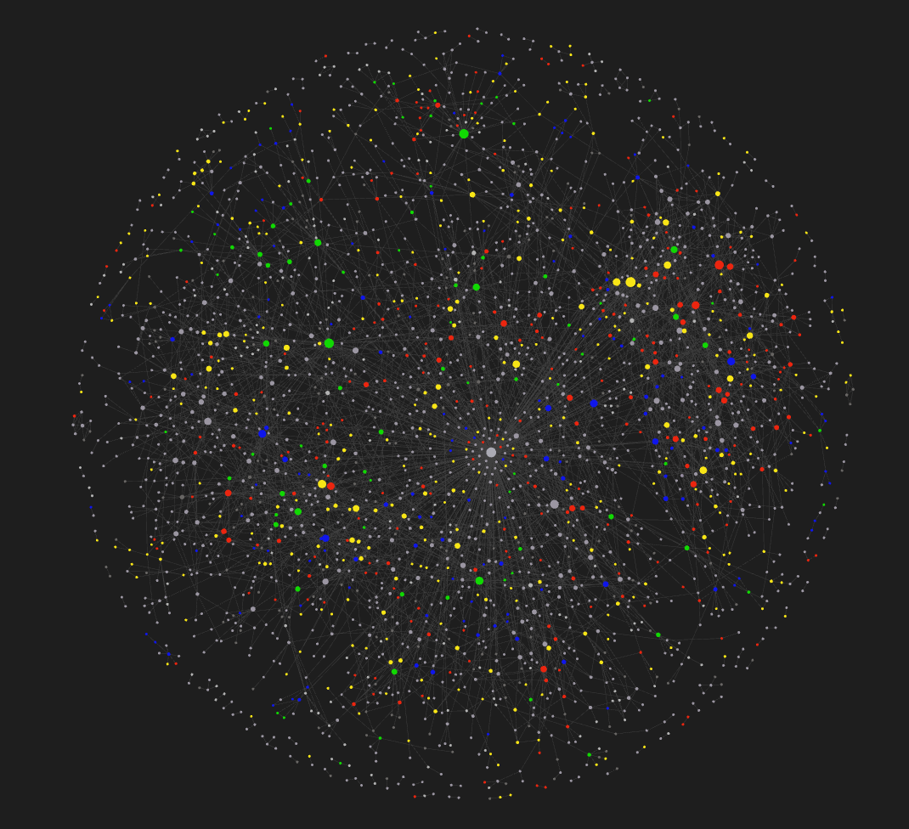

# hal_md

Personal relationship management of your ego social network using plain-text Markdown files. Think of it like a Personal CRM on steroids.

At this point, this is a collection of templates with instructions and over time it will evolve. The approach relies heavily on a Personal Knowledge Management (PKM) tool like [Obsidian](https://obsidian.md/) but could work with any text editor.

## Context

Getting here has been a decades-long journey which you can read about in [The Long and Winding Road](docs/journey.md).

## Start with the end in mind

This will take a long time to build out and require some attention to detail.

Here's the visualization of my social network in Obsidian. This is a filter of the Markdown files that have `tags: [person]` in their frontmatter – the meta-data at the top of my note files. The colors represent which category I have the person in such as the bright green for my "A-listers" where I have the tags `person` and `alist` 😂.

## Navigating your social network

You can use any text editor but preferably one that supports wikilinks, YAML frontmatter, and queries. 

1. [Obsidian](https://obsidian.md/) by fellow Canadians [Erica Xu](https://github.com/ericaxu) and [Shida Li](https://github.com/lishid)
2. [Silver Bullet](https://github.com/silverbulletmd) which is Open-Source by Polish [Zef Hemel](https://github.com/zefhemel)

I haven't checked if [GitJournal](https://github.com/GitJournal/GitJournal) by [Vishesh Handa](https://www.linkedin.com/in/visheshhanda/) supports YAML frontmatter but it does support wikilinks so you'll still be able to navigate your notes.

Obsidian has a graph view (aka Map of Content aka MoC) which is fun to visualize your social network. [Visual Studio](https://visualstudio.microsoft.com/) is handy as well.

## How it works

Simply use Obsidian and start creating files for each `Person`, `Organization`, and optionally `Place` using the [templates](templates). Include wikilinks (`[[name]]`) to "connect" the people, places, and organizations together as you go. 

1. Start by creating a file for a person in your network using [Person.md](templates/Person.md) template
2. Name the file `FirstName Lastname.md`
3. Fill in as little or as much of the metadata on the person
4. List the people they're connected to under `## People` using `[[FirstName LastName]]` 
5. List their positions under `## Positions` using `Title, [[Organization Name]]` 
6. Click on each person under `## People`
7. Have a sip of your favorite drink
8. Go to Step 1

### Bonus points

For each Organization under `## Organization` fill in as little or as much information on the organization.

For each person under `## People` I also add tags like

- `#friend`, `#family`, `#business` to qualify the relationship
- `#weak`, `#strong`, `#very-strong` to track the strength of the ties between them 

## Folders, or no Folders, it's up to you

In my `notes` folder, I use the following folder structure:

- `attachments` - for any files, images, photos
- `organizations` - put all the company profiles in here
- `people` - put all the people in here. Subfolder with their `slug` and then dated files for each interaction
- `personal` - my personal notes
- `templates` - the files from [templates](templates)

## Templates

There are a set of templates I use to track my social network. Each contain a set of metadata at the top also known as YAML frontmatter.

File | For what | Notes
---|---|---
[Call.md](templates/Call.md) | phone calls | Do people still make these?
[Chat.md](templates/Chat.md) | instant messaging chat | e.g. LinkedIn, Signal
[Organization.md](templates/Organization.md) | for schools and companies | Where a `Person` studie, volunteers, or works
[Person.md](templates/Person.md) | for schools and companies | The actual person!
[Place.md](templates/Place.md) | a physical place | may link to People in form of `[personA, personB]`
[Post.md](templates/Post.md) | a social media  | Material post by a `Person` 
[Product.md](templates/Product.md)| products | List of product slugs in `[]` worked on by a `Person` and/or `Organization`
[Video.md](templates/Video.md) |  videos | e.g. YouTube video by `People`

## Helper tools

I've written some Python tools to convert the exports from various messaging apps to Markdown. So far, I've created [linkedin_md](https://github.com/thephm/linkedin_md), [signal_md](https://github.com/thephm/signal_md), and [sms_backup_md](https://github.com/thephm/sms_backup_md). Why? So I can get **my** conversations with people in **my** network into **my** own files that **I** can control and use directly with **my** social network data. Each of those tools rely on [message_md](https://github.com/thephm/message_md).

